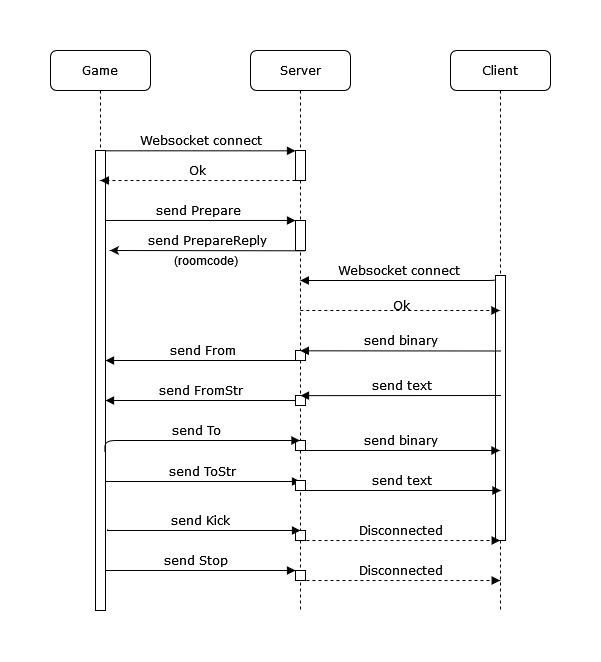

WMB (Websocket multiplayer backend)
====================================

This is a pet weekend project to learn & enjoy Rust. Use at your own risk.

### Introduction

WMB is a project is to help more party games to sprout by providing a backend implementation.
The base implementation is a one (*Game*) to many (*Clients*) connection communication pattern, which is coordinated by the *Server*, allowing **serverless party games**.

The *Game* connects to the *Server* with a websocket and creates a room. Once the room is created, the *Game* will receive the **Room Code** which will be used by *Clients* to connect.

While the *Game* has a mandatory communication pattern with the *Server*, the *Clients* have a **seemingly direct connection to the *Game***, both in **binary** and **text**.

### Usage

5. Spin this **Server**, `cargo run --release`
5. **Game** creates a websocket connection to this server to create a game `new WebSocket("ws://127.0.0.1:8081/CREATE")`
5. **Game** sends Prepare with a certain amount of players.
5. **Server** sends to **Game** the *Room Code* and refuses players if there are too many
5. **Clients** creates a websocket connection to this server to create a game `new WebSocket("ws://127.0.0.1:8081/ROOM_CODE")`
5. **Game** sends Start once enough players are connected.
5. **Game** sends data to **Clients** with To and ToStr messages.
5. **Clients** sends data to **Game** with plain text or arraybuffer (for binary format).
5. **Game** receives data from **Clients** with From and FromStr messages.

### In depth

Then endpoint of the websocket server is defining if you are a Host client (Game) or a Player client by the websocket you created.
- `ws://127.0.0.1:8081/CREATE` creates a new game
- `ws://127.0.0.1:8081/ROOM` connects to a room

#### Messages

The messages for the *Game* are **CBOR** encoded with the following format: `{ "cmd": "snake_case_command", "data1": 1, "data2": "data2"}`

For rust users, just take a look at the enum [src/comm.rs#Commands](src/comm.rs).
For Javascript users:
- **\> Prepare**: `{"cmd": "prepare", "max_players": 8}` # Prepares the game with the maximum number of clients
- **< PrepareReply**: `{"cmd": "prepare_reply", "key": "ROOM"}` # On successful game creation, provides the ROOM key
- **\> Start**: `{"cmd": "start"}` # Starts the game, prevents the clients to connect from this point on.
- **< State**: `{"cmd": "state", "players": [5,2,3], "max_players": 8, "accept_conns": true}` # Provides information about the game, players connected, etc.
- **\> Kick**: `{"cmd": "kick", "player": 5}` # Kicks player with id 5 (from the State message)
- **< Stop**: `{"cmd": "stop"}` # Disconnect everybody
- **\> To**: `{"cmd": "to", to: [2], "data": [1,2,3]}` # Sends binary data to the user 1
- **\> ToStr**: `{"cmd": "to_str", to: [3, 5], "data": "some string"}` # Sends text data to the user 3 and 5
- **< From**: `{"cmd": "from", "from": 2, "data": [1,2,3]}` # Received when user 2 sent binary data
- **< FromStr**: `{"cmd": "from", "from": 5, "data": "some string"}` # Received when user 5 sent string data
